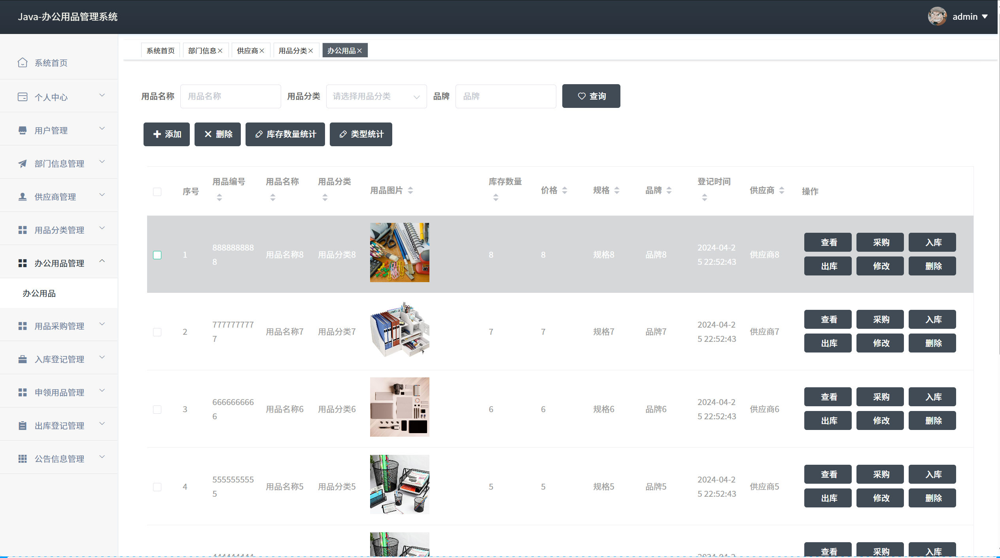
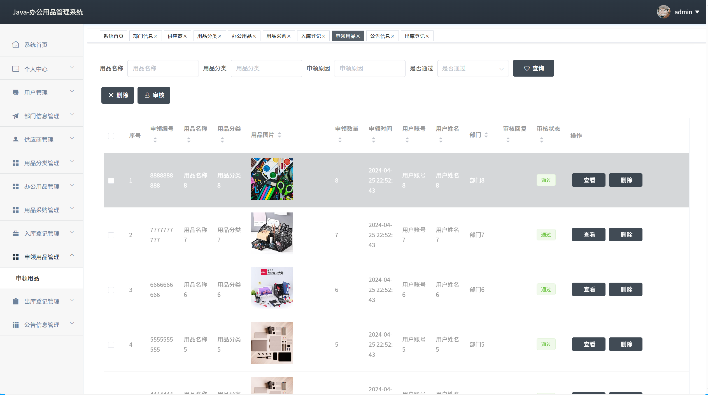

# springbootA405
springbootA405基于办公用品管理系统
 
## 查看主页获取源码

### 一、关键词

办公物资管理系统，办公设备管理系统，数字化办公用品管理平台

 

### 二、作品包含

源码+数据库+全套环境和工具资源+部署教程

 

### 三、项目技术

前端技术：Html、Css、Js、Vue2.0、Element-ui 
后端技术：Java、SpringBoot2.0、MyBatis

  

 

### 四、运行环境（以下版本亲测，其他版本未知，请自测）

开发工具：IDEA/eclipse  + VSCODE

数据库：MySQL5.7（最低要5.7版本）

数据库管理工具：Navicat10以上版本

环境配置软件： JDK1.8 + Maven3.6.3

前端Nodejs：14

浏览器：谷歌浏览器

 

### 五、项目介绍

项目编号：springbootA405

办公用品管理系统可实现对办公用品从采购、入库、领用、库存到报废的全流程数字化管理，提升管理效率、降低成本并优化资源调配
系统首页呈现办公用品总数及统计图表；用户管理；部门信息管理可增删改查部门信息；供应商管理能对供应商信息进行添加、删除、查询等；用品分类管理可操作用品分类信息；办公用品管理涵盖增删改查、采购、出入库等；用品采购管理可处理采购信息；入库登记管理记录入库情况；申领用品管理涉及用品申领及审核；出库登记管理登记出库信息；公告信息管理
 

### 六、运行截图

